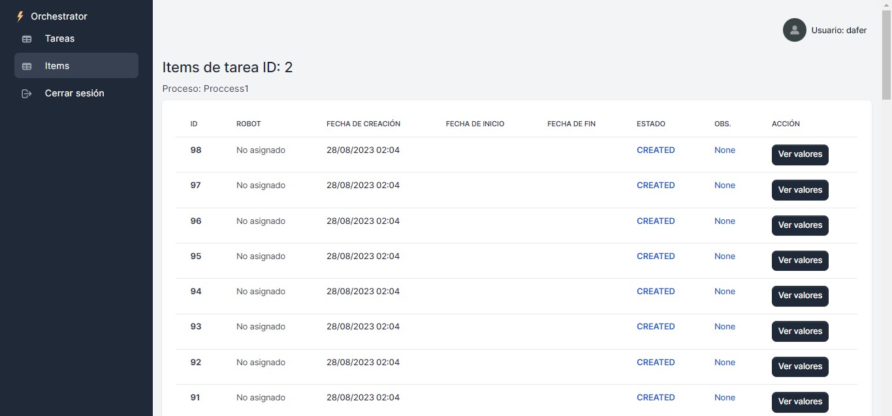

# Orchestrator RPA

The Orchestrator RPA Project is a platform that enables users to upload and manage massive tasks to be processed by automation robots (RPA). This tool addresses the problem of the need to perform repetitive and multiple tasks in systems that do not support the massive input of requests. Likewise, it integrates an orchestrator that intelligently assigns tasks to the robot with the fewest items under its responsibility.

## Problem Description

Many companies face the challenge of performing repetitive tasks manually due to limitations in the systems they use. This project aims to solve this problem by allowing users to upload massive tasks in a CSV format, which are then efficiently processed by automation robots.

## Key Features

* User-friendly and responsive graphical interface for users.
* User authentication for task uploading and management.
* Ability to upload tasks with multiple items (e.g., phone numbers, account numbers).
* API for robots to connect and make requests.
* Robot status (ACTIVE/INACTIVE) and state change through PATCH requests.
* Automatic assignment of tasks to active robots for efficiency optimization.
* Automatic disconnection of inactive robots.
* Pulse system for monitoring robot activity.
* Utilization of Celery for automatic task assignment and finding available robots.
* Integration with Django REST Framework for the API.

## Configuration and Requirements

### 1. Installing project dependencies

#### 1.1 Create the `.env` file in the project's root directory, for example:
```
SECRET_KEY='django-insecure-yyq+f%345b#%1r-)vbfernando9+i9%bzn)229yk)h&3wpzjb-_t'
```

#### 1.2 Create a Python environment
```bash
python3 -m virtualenv env
source env/bin/activate
```

#### 1.3 Install libraries and packages
```bash
pip install -r requirements.txt
```

#### 1.4 Install Celery and RabbitMQ

```bash
sudo apt-get update
sudo apt-get install celery 
sudo apt-get install rabbitmq-server
```

### 2. Configure the database and migrate

```bash
python3 manage.py makemigrations
python3 manage.py migrate
```

### 3. Create Superuser

```bash
python3 manage.py createsuperuser
```

### 4. Create robots and processes

Before creating robots, a user must be created for each robot; subsequently, the robot is created by passing the created user as an argument to its `robot_id` attribute.

You can make any modifications such as creating users, robots, and processes by logging in to:
https://localhost:8000/admin

You can also do it using the Django Shell:

```bash
python3 manage.py shell
```

```python
    >>> from django.contrib.auth.models import User
    >>> from robots.models import Robot
    >>> from processes.models import Process
    >>> user1 = User.objects.create(username='robot1', password='123')
    >>> robot1 = Robot.objects.create(user_id=user1, ip_address='0.0.0.1')
    <Robot: 0.0.0.1>
    >>> process1 = Process.objects.create(title='Proccess1')
```

Remember that a process is something to be carried out by the robot, for example (Balance reload, Account registration, etc).
This logic should be configured in your own way within your robot.

### 5. Start the RabbitMQ server

Check if it's already running:
```bash
sudo rabbitmqctl status
```
If it's not running, then start the server.
```bash
sudo rabbitmq-server
```

### 6. ⚠️Necessary actions

Before running the server, you must uncomment the lines in the `robots/tasks.py` and `tasks/views.py` modules.

### 7. Start the Django server

```bash
python3 manage.py runserver
```

### 8. Initiate Celery Beat

Navigate to the root path of the project and execute:
```bash
celery -A orchestrator beat -l info
```

### 9. Initiate the Celery Worker

Navigate to the root path of the project and execute:
```bash
celery -A orchestrator worker -l info
```

## ✅Application Usage
### ✅Basic Login Form
Log in using your credentials; afterward, you will be able to view the user dashboard.

### ✅Simple Dashboard
You can also visualize the number of connected robots, tasks, and loaded items.

### ✅Creating tasks
Add tasks by clicking on (+ New task), upload the `.csv` file, and it will automatically start assigning tasks as soon as a connected robot is found.



## CSV Format

To upload tasks to the Orchestrator RPA Project, you must use a CSV file with the following format:
```
    linea,valor,field_name
    1,a,hello
    2,b,hello
    3,c,hello
```
- `linea`: Line number or count (integer).
- `valor`: Task value (text).
- `field_name`: Name of the field associated with the task, you can use it for another important field (text).

Make sure that the fields are separated by commas and that each line represents an individual task. This format allows you to upload tasks with multiple items, such as phone numbers or account numbers, along with the task description and associated field.

## Using Robots

Robots can be programmed in different RPA languages or IDEs, such as UiPath, AA360, PowerAutomate, Python, etc. The API provides a way to establish a connection between the robots and the web platform.

## Using the API

The Orchestrator RPA Project's API allows you to interact with the robots and efficiently manage tasks. All API requests are intended to be made by the Robots. For security reasons, they must include an authorization token (don't forget to create it in the admin panel) in the header for authentication. The authentication header must have the following format:

`Authorization: Token XXXX-XXXX-XXXX-XXXX`

Below are examples of how to use some of the available endpoints:

### Get/Modify Robots

To retrieve/modify information about robots, make a GET/PATCH request to the `/api/robots/` endpoint with the authorization token in the header.

```
GET /api/robots/
Authorization: Token XXXX-XXXX-XXXX-XXXX
Params: {"robot_id": 1, "status": "ACTIVE" }
```
```
PATCH /api/robots/
Authorization: Token XXXX-XXXX-XXXX-XXXX
Params: {"robot_id": 1, "status": "ACTIVE" }
```

### Get/Modify Tasks

To retrieve/modify information about tasks, make a GET/PATCH request to the `/api/tasks/` endpoint with the authorization token in the header:

```
GET /api/tasks/
Authorization: Token XXXX-XXXX-XXXX-XXXX
Params: {"robot_id": 1}
```
```
PATCH /api/tasks/
Authorization: Token XXXX-XXXX-XXXX-XXXX
Params: {"item_id": 1, "status": "COMPLETED", "observation": "Sin observaciones"}
```

### Modify Items
Only the PATCH endpoint `/api/items/` is enabled to modify an item once it's completed, as all items/values are obtained through the GET TASKS endpoint.
```
PATCH /api/tasks/
Authorization: Token XXXX-XXXX-XXXX-XXXX
Params: {"robot_id": 1, "task_id": 1, "status": "COMPLETED"}
```


Remember that the parameters may vary as you make the requests, the API documentation is located at:  http://localhost:8000/docs

## Credits

Developed by [@daferferso](https://github.com/daferferso). IInspired by the necessity to automate repetitive tasks in corporate environments with proper robot management.
Thanks to [@themesberg](https://github.com/themesberg) and [@app-generator](https://github.com/app-generator) for the VOLT template.

## License

This project is under the MIT License. See the file [LICENSE.md](LICENSE.md) for more details.
